# MenuKaran

Create and Install dekstop folders manually. 

> The word MenuKaran, is a mix of two words, Menu is in English and 'Karan' in Sanskrit means to do something

## Features

- Install desktop files manually.
- Search through the list of desktop files created manually.(WIP)
- Open and Edit any desktop file.

To make this app work properly, I don't need access to any special folders directly, not even the access to `$HOME`. This will work completely on portals. Just to make the app proper, I'll need to read the `.local/share/applications` folder, else there will be a popup of no-access whenever try to open this folder as initial folder. Made with snap package, ecosystem and security in mind.

## Tech Stack

- Flutter(UI toolkit)
- Dart(Language Backend)

### Dart Packages needed

* animated_icon: ^0.0.5
* cupertino_icons: ^1.0.2
* desktop_entry
* feather_icons: ^1.2.0
* file_selector: ^1.0.1
* handy_window: ^0.3.1
* icon_animated: ^1.2.1
* lottie: ^2.7.0
* path: ^1.8.3
* provider: ^6.1.1
* shared_preferences: ^2.2.2
* sqflite_common_ffi: ^2.3.0+4
* url_launcher: ^6.2.1
* yaru: ^1.2.0
* yaru_icons: ^2.2.2
* yaru_widgets: ^3.3.1

Thanks to all these packages and specifically the destop_entry package, this app has been successful.

## Installation

- Snap Package:

    > Coming Soon

- From Source:

1. Install [Flutter](https://docs.flutter.dev/get-started/install/linux)
2. Clone this repository by

    `git clone https://github.com/soumyaDghosh/sorted.git && cd sorted`

3. Run `flutter build linux --release`

### Screenshots

|Dark | Light|
|-|-|
|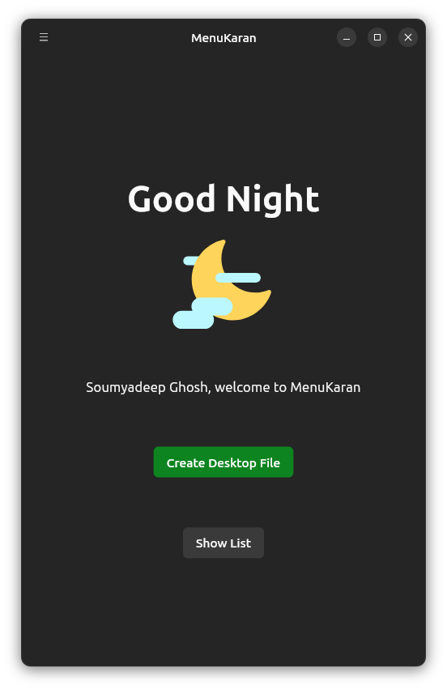|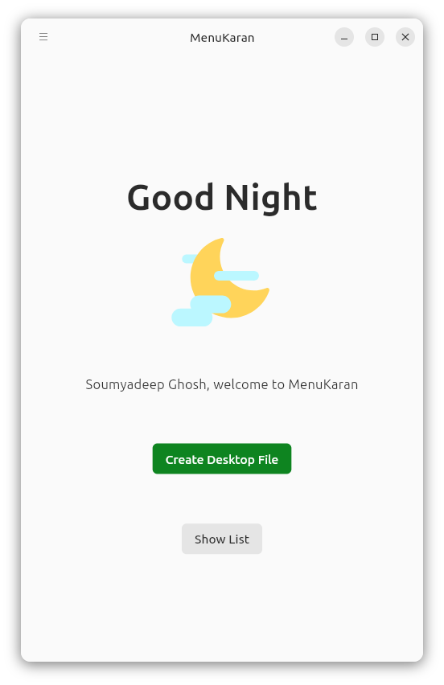|
|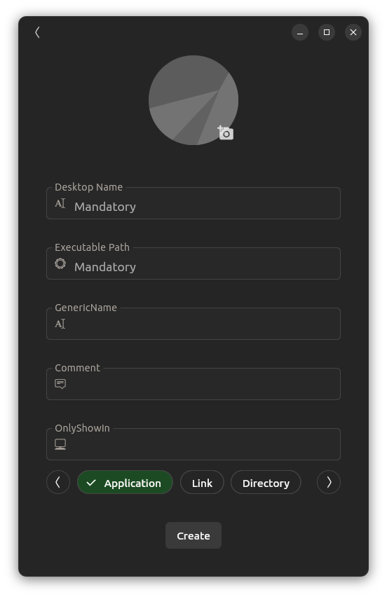|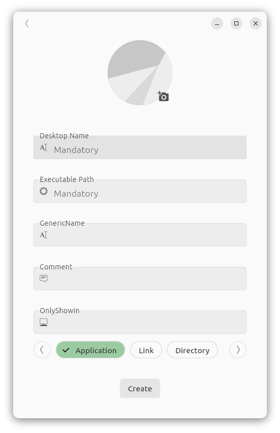|
|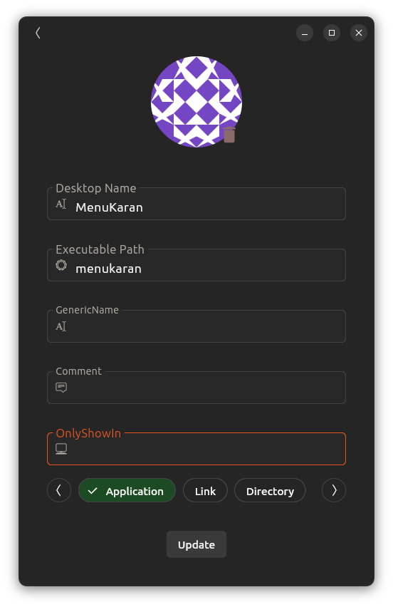|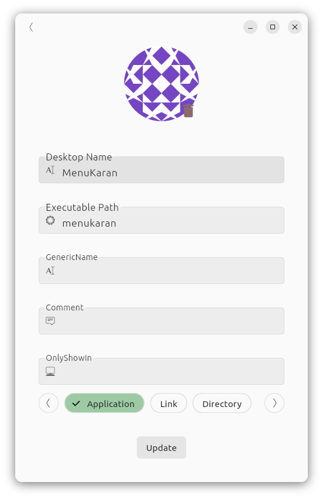|
|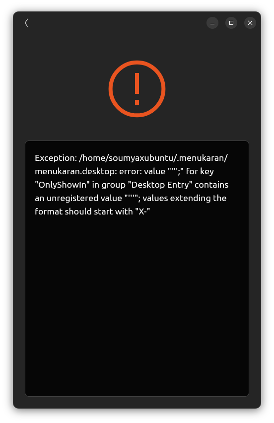|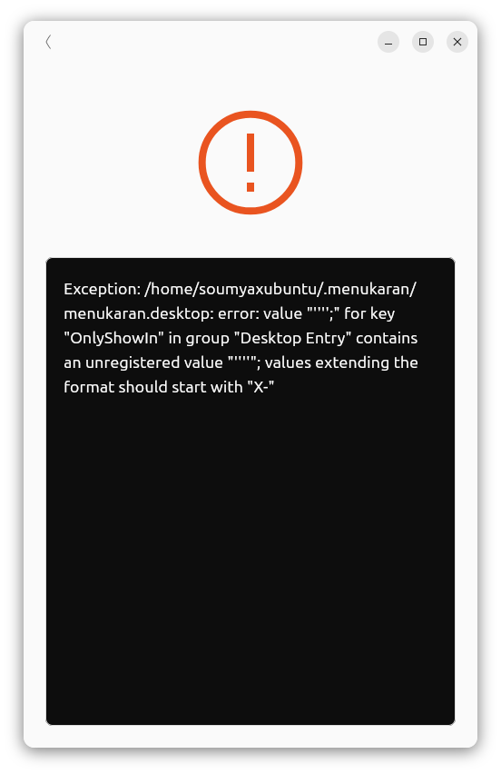|
|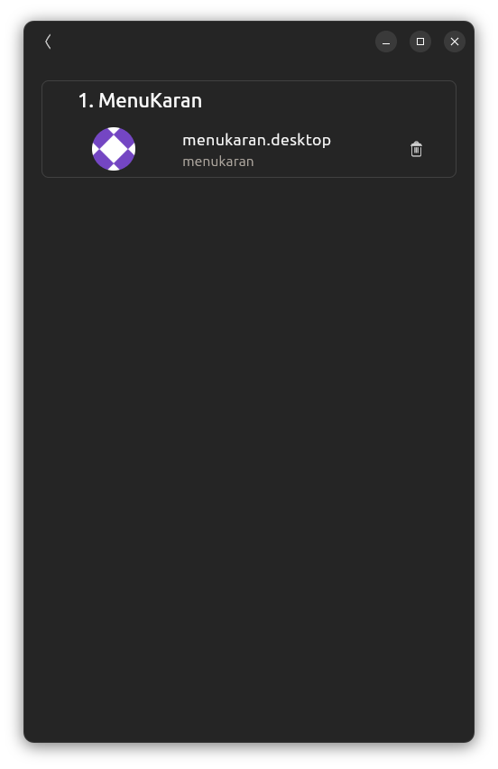|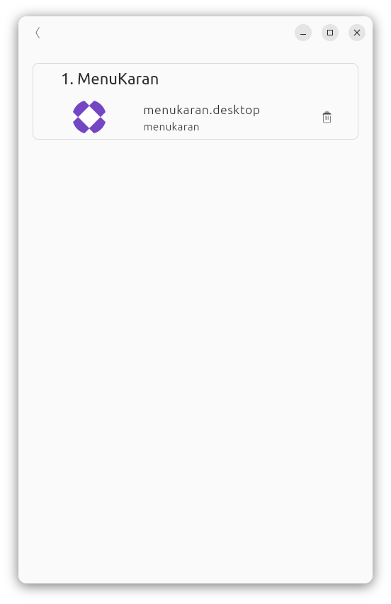|
|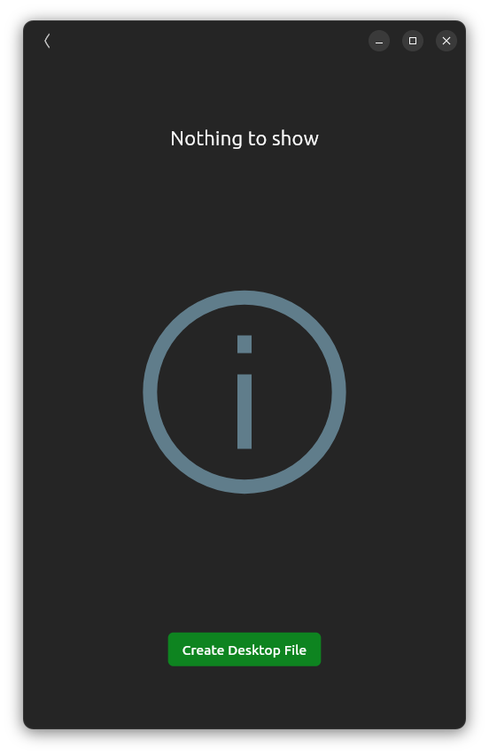|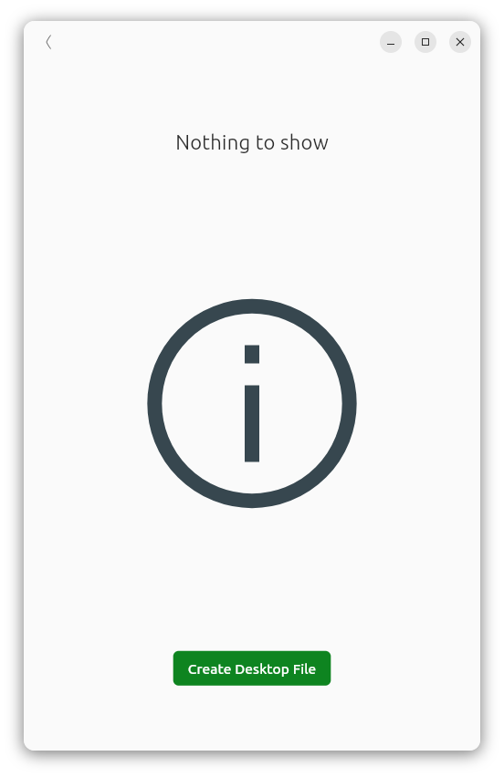|
|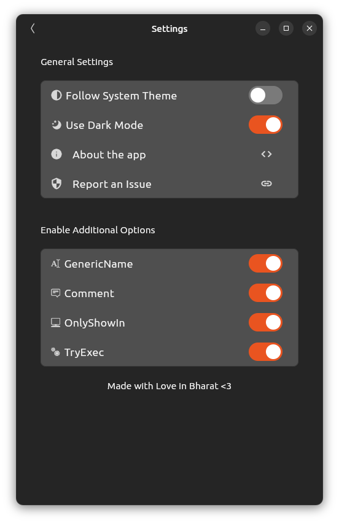|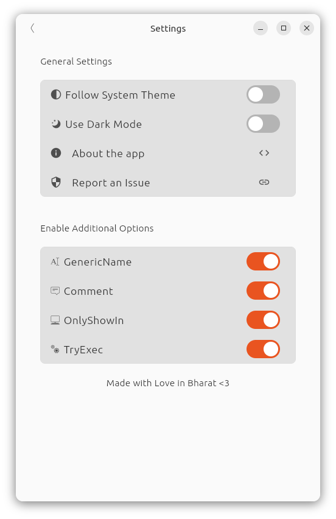|
|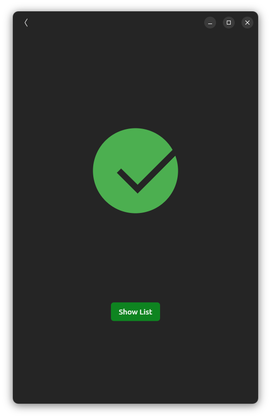|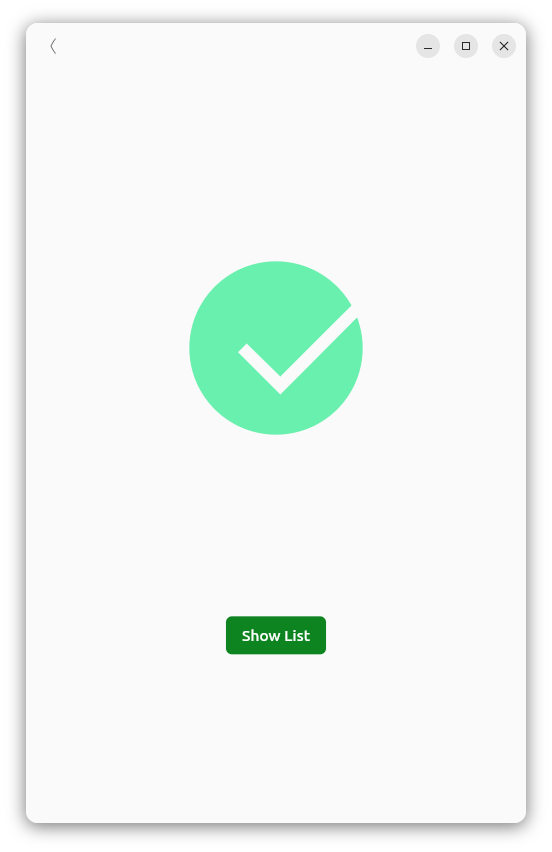|

